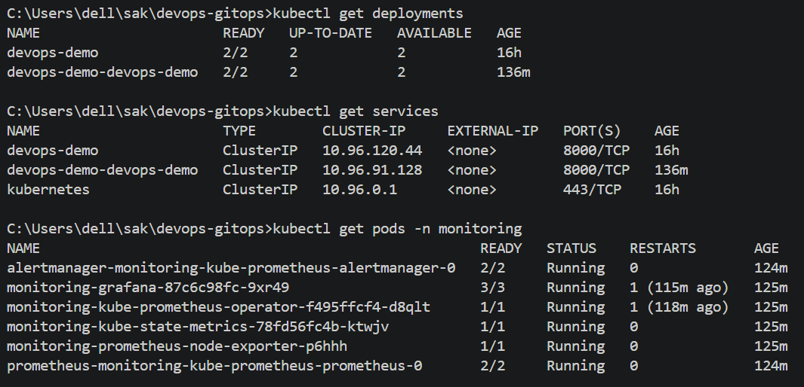
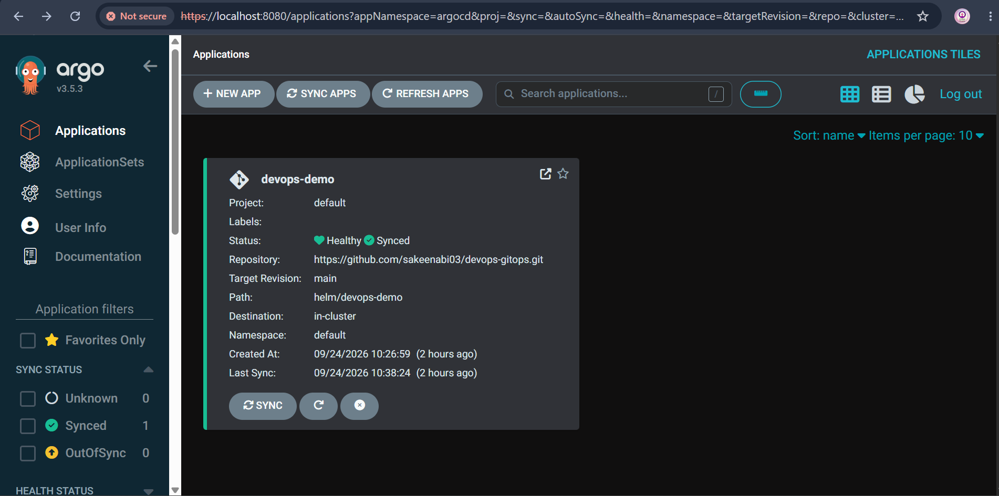
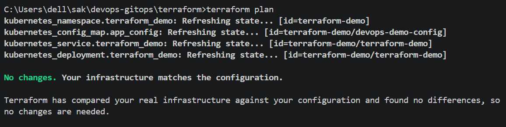
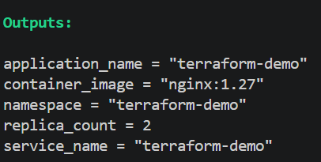
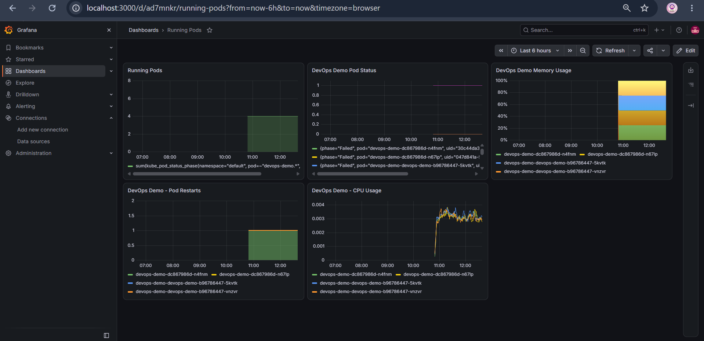

# DevOps GitOps Platform

This repository contains the Kubernetes deployment configuration and Infrastructure as Code components for the **Automated Kubernetes Deployment Platform Using Terraform & GitOps** project.

The repository is responsible for the deployment and infrastructure side of the project and works together with the separate application repository.

The project demonstrates a complete DevOps workflow using:

* Kubernetes
* Kind
* Helm
* Argo CD
* Terraform
* GitHub Actions
* Docker
* GitHub Container Registry (GHCR)
* Trivy
* Prometheus
* Grafana

The environment runs locally using a Kind Kubernetes cluster, allowing the complete workflow to be demonstrated without requiring a paid cloud Kubernetes environment.

---

# Table of Contents

* [Project Overview](#project-overview)
* [Overall Architecture](#overall-architecture)
* [Repository Structure](#repository-structure)
* [Repository Components](#repository-components)
* [Helm](#helm)
* [Helm Chart Structure](#helm-chart-structure)
* [Kubernetes Deployment](#kubernetes-deployment)
* [Kubernetes Service](#kubernetes-service)
* [Argo CD](#argo-cd)
* [Argo CD Application](#argo-cd-application)
* [Automated Synchronization](#automated-synchronization)
* [GitOps Demonstration](#gitops-demonstration)
* [Terraform](#terraform)
* [Terraform Architecture](#terraform-architecture)
* [Kind Kubernetes Cluster](#kind-kubernetes-cluster)
* [Monitoring](#monitoring)
* [Prometheus](#prometheus)
* [Grafana](#grafana)
* [Complete CI/CD and GitOps Workflow](#complete-cicd-and-gitops-workflow)
* [Application Repository](#application-repository)
* [CI Pipeline](#ci-pipeline)
* [Automated Testing](#automated-testing)
* [Docker](#docker)
* [Container Security](#container-security)
* [GitHub Container Registry](#github-container-registry)
* [Deployment Strategy](#deployment-strategy)
* [Repository Responsibilities](#repository-responsibilities)
* [Prerequisites](#prerequisites)
* [Clone the Repository](#clone-the-repository)
* [Verify Kubernetes](#verify-kubernetes)
* [Install Helm Dependencies](#install-helm-dependencies)
* [Monitoring Installation](#monitoring-installation)
* [Access Grafana](#access-grafana)
* [Access Prometheus](#access-prometheus)
* [Access Argo CD](#access-argo-cd)
* [Useful Kubernetes Commands](#useful-kubernetes-commands)
* [Project Validation](#project-validation)
* [Key DevOps Concepts Demonstrated](#key-devops-concepts-demonstrated)
* [Local Development Architecture](#local-development-architecture)
* [Production Considerations](#production-considerations)
* [Important Design Decision](#important-design-decision)
* [Summary](#summary)

---

# Project Overview

The project is divided into two Git repositories.

### Application Repository

`devops-demo`

This repository contains:

* FastAPI application
* Application tests
* Dockerfile
* Application Kubernetes configuration
* Helm chart
* GitHub Actions CI pipeline
* Trivy container security scanning
* GHCR image publishing

### GitOps Repository

`devops-gitops`

This repository contains:

* Helm deployment configuration
* Argo CD application configuration
* Terraform infrastructure configuration
* Kubernetes deployment configuration
* GitOps state
* Project-level deployment documentation

The two repositories work together to create the complete deployment workflow.

---

# Overall Architecture

```text
                         Developer
                             |
                         git push
                             |
             +---------------+---------------+
             |                               |
             v                               v
       devops-demo                      devops-gitops
       Application Repo                 GitOps Repo
             |                               |
             v                               |
       GitHub Actions                         |
             |                               |
       +-----+------+                        |
       |            |                        |
       v            v                        |
    Pytest       Docker Build               |
                    |                        |
                    v                        |
                  Trivy                      |
                    |                        |
                    v                        |
                  GHCR                       |
                    |                        |
                    |                        v
                    +--------------->      Argo CD
                                             |
                                             v
                                      Kubernetes / Kind
                                             |
                         +-------------------+-------------------+
                         |                   |                   |
                         v                   v                   v
                       Helm              Terraform        Monitoring
                         |                   |                   |
                         v                   v                   v
                    Application       Supporting Infra     Prometheus
                                                               |
                                                               v
                                                            Grafana
```

---

# Repository Structure

```text
devops-gitops/
│
├── helm/
│   └── devops-demo/
│       ├── Chart.yaml
│       ├── values.yaml
│       └── templates/
│           ├── deployment.yaml
│           └── service.yaml
│
├── terraform/
│   ├── main.tf
│   ├── variables.tf
│   ├── outputs.tf
│   ├── README.md
│   └── .gitignore
│
└── README.md
```

---

# Repository Components

The repository contains three major areas:

```text
helm/
argocd/
terraform/
```

Each has a different responsibility.

| Directory    | Purpose                                  |
| ------------ | ---------------------------------------- |
| `helm/`      | Kubernetes application packaging         |
| `argocd/`    | GitOps continuous delivery configuration |
| `terraform/` | Infrastructure as Code                   |
| `README.md`  | Project documentation                    |

---

# Helm

The `helm/devops-demo` directory contains the Helm chart used to package and deploy the application to Kubernetes.

The chart includes:

* Deployment
* Service
* Replica configuration
* Container image configuration
* Container port
* Readiness probe
* Liveness probe

Helm allows Kubernetes deployment configuration to be maintained as a reusable package.

---

# Helm Chart Structure

```text
helm/devops-demo/
│
├── Chart.yaml
├── values.yaml
│
└── templates/
    ├── deployment.yaml
    └── service.yaml
```

## Chart.yaml

Contains Helm chart metadata.

```yaml
apiVersion: v2
name: devops-demo
description: Helm chart for the DevOps demo application
type: application
version: 0.1.0
appVersion: "1.0.0"
```

---

## values.yaml

The `values.yaml` file contains configurable deployment values.

Example:

```yaml
replicaCount: 2

image:
  repository: ghcr.io/<github-username>/devops-demo
  tag: "<commit-sha>"
  pullPolicy: IfNotPresent

service:
  type: ClusterIP
  port: 8000
  targetPort: 8000

container:
  port: 8000
```

The image tag references the container image produced by GitHub Actions.

A commit SHA is used as the image tag so that each deployment can reference a specific application build.

---

# Kubernetes Deployment

The Helm Deployment template creates the application Pods.

The application runs on:

```text
Port: 8000
```

The Deployment also includes health checks.

## Readiness Probe

```text
GET /health
```

The readiness probe determines whether the application is ready to receive traffic.

If the application is not ready, Kubernetes can prevent the Pod from receiving traffic through the Service.

## Liveness Probe

```text
GET /health
```

The liveness probe helps Kubernetes determine whether the application container is still functioning.

If the container continuously fails the liveness check, Kubernetes can restart it.

---

# Kubernetes Service

The application is exposed through a Kubernetes `ClusterIP` Service.

```text
Service Type: ClusterIP
Port: 8000
Target Port: 8000
```

The Service provides internal Kubernetes networking to the application Pods.

---

# Argo CD

Argo CD provides the GitOps continuous delivery layer.

Argo CD monitors the GitOps repository and compares the desired state stored in Git with the actual state of the Kubernetes cluster.

The workflow is:

```text
Git Push
   |
   v
GitOps Repository
   |
   v
Argo CD
   |
   v
Helm
   |
   v
Kubernetes
```

When the Helm configuration changes in Git, Argo CD detects the change and synchronizes the Kubernetes cluster.

---

# Argo CD Application

The Argo CD application is configured to monitor:

```text
Repository: devops-gitops
Path: helm/devops-demo
Revision: main
```

The Kubernetes destination is:

```text
https://kubernetes.default.svc
```

The application is deployed into:

```text
default
```

namespace.

---

# Automated Synchronization

Argo CD is configured with:

* Automated sync
* Prune
* Self-heal

This means that Git represents the desired state of the application deployment.

For example:

```text
Change values.yaml
       |
       v
git commit
       |
       v
git push
       |
       v
Argo CD detects change
       |
       v
Kubernetes updated
```

---

# GitOps Demonstration

A GitOps deployment test was performed by changing the application replica count in:

```text
helm/devops-demo/values.yaml
```

The replica count was changed and pushed to GitHub.

Argo CD detected the Git change and automatically synchronized the Kubernetes deployment.

This demonstrates:

```text
Git
 ↓
Argo CD
 ↓
Kubernetes
```

without manually running `kubectl apply` for the application deployment.

---

# Terraform

The `terraform` directory contains Terraform configuration used to demonstrate Infrastructure as Code.

Terraform connects to the Kubernetes API using the Kubernetes provider.

Terraform currently manages:

* Kubernetes namespace
* Kubernetes ConfigMap
* Kubernetes Deployment
* Kubernetes Service
* Replica count
* Container image
* CPU requests
* CPU limits
* Memory requests
* Memory limits
* Readiness probe
* Liveness probe

The Terraform-managed resources are placed in:

```text
terraform-demo
```

namespace.

For detailed Terraform documentation, see:

```text
terraform/README.md
```

---

# Terraform Architecture

```text
Terraform
    |
    v
Kubernetes Provider
    |
    v
Kubernetes API
    |
    v
Kind Cluster
    |
    v
terraform-demo namespace
    |
    +-- ConfigMap
    |
    +-- Deployment
    |
    +-- Service
```

The Kind cluster itself is not currently provisioned by Terraform.

Terraform manages Kubernetes resources inside the existing Kind cluster.

---

# Kind Kubernetes Cluster

The project uses Kind to run Kubernetes locally.

Kind runs Kubernetes nodes as Docker containers.

The cluster used by this project is:

```text
devops-cluster
```

The Kubernetes context is:

```text
kind-devops-cluster
```

Check the current context:

```bash
kubectl config current-context
```

Check the cluster nodes:

```bash
kubectl get nodes
```

---

# Monitoring

The project includes Prometheus and Grafana for Kubernetes monitoring.

Prometheus collects Kubernetes and container metrics.

Grafana provides dashboards for visualizing the collected metrics.

The monitoring stack is installed using the Prometheus Community Helm chart.

---

# Prometheus

Prometheus is used for metrics collection.

The project uses PromQL queries to monitor:

* Running Pods
* CPU usage
* Memory usage
* Pod status
* Pod restarts
* Kubernetes resources

Example:

```promql
up
```

Another example:

```promql
kube_pod_info
```

---

# Grafana

Grafana is used to visualize Kubernetes metrics collected by Prometheus.

The dashboard created for this project includes:

* Running Pods
* CPU Usage
* Memory Usage
* Pod Status
* Pod Restarts
* Kubernetes Monitoring

Example CPU query:

```promql
sum(rate(container_cpu_usage_seconds_total{namespace="default", pod=~"devops-demo.*", container!="POD", container!=""}[5m])) by (pod)
```

Example memory query:

```promql
sum(container_memory_working_set_bytes{namespace="default", pod=~"devops-demo.*", container!="POD", container!=""}) by (pod)
```

---

# Complete CI/CD and GitOps Workflow

The complete project workflow is:

```text
                    Developer
                        |
                        v
                  GitHub Push
                        |
                        v
              +-------------------+
              |  devops-demo      |
              | Application Repo  |
              +-------------------+
                        |
                        v
                 GitHub Actions
                        |
            +-----------+-----------+
            |           |           |
            v           v           v
          Tests       Docker      Trivy
                      Build       Scan
            |           |           |
            +-----------+-----------+
                        |
                        v
                      GHCR
                        |
                        v
                GitOps Repository
                        |
                        v
                     Argo CD
                        |
                        v
                      Helm
                        |
                        v
                 Kubernetes / Kind
                        |
                 +------+------+
                 |             |
                 v             v
            Application    Terraform
                              |
                              v
                         Supporting
                        Infrastructure
                        |
                        v
                 Prometheus + Grafana
```

---

# Application Repository

The application source code is maintained separately in:

```text
devops-demo
```

The application repository contains:

```text
devops-demo/
│
├── app/
│   └── main.py
│
├── tests/
│   └── test_main.py
│
├── helm/
│   └── devops-demo/
│
├── k8s/
│
├── .github/
│   └── workflows/
│       └── ci.yml
│
├── Dockerfile
├── requirements.txt
└── README.md
```

The application is a FastAPI service with:

```text
GET /
GET /health
GET /api/info
```

---

# CI Pipeline

GitHub Actions is used for continuous integration.

The pipeline performs:

1. Checkout source code
2. Set up Python
3. Install dependencies
4. Run pytest
5. Log in to GHCR
6. Build Docker image
7. Scan image with Trivy
8. Push image to GHCR

The workflow is defined in:

```text
devops-demo/.github/workflows/ci.yml
```

---

# Automated Testing

The application includes automated tests using pytest.

The CI pipeline runs:

```bash
pytest
```

before publishing the Docker image.

This ensures that application tests pass before the image is pushed to GHCR.

---

# Docker

The application is containerized using Docker.

The Dockerfile:

* Uses Python 3.12
* Installs application dependencies
* Copies the FastAPI application
* Exposes port 8000
* Starts the application using Uvicorn

The application container is built by GitHub Actions.

---

# Container Security

Trivy is used to scan the Docker image for vulnerabilities.

The CI pipeline checks for:

```text
CRITICAL
HIGH
```

severity vulnerabilities.

The workflow is configured to fail when applicable vulnerabilities are detected.

This adds a security scanning stage before the image is published to GHCR.

---

# GitHub Container Registry

The built Docker image is published to GitHub Container Registry.

The image follows this structure:

```text
ghcr.io/<github-username>/devops-demo:<commit-sha>
```

The commit SHA is used as the image tag.

This allows each image to be associated with a specific source-code commit.

---

# Deployment Strategy

The application deployment uses GitOps.

The desired Kubernetes configuration is stored in Git.

Argo CD continuously monitors the GitOps repository.

When the desired configuration changes:

```text
Git Change
    |
    v
Argo CD
    |
    v
Helm
    |
    v
Kubernetes
```

The Kubernetes cluster is updated to match the desired state stored in Git.

---

# Repository Responsibilities

The two repositories have separate responsibilities.

| Repository      | Responsibility                         |
| --------------- | -------------------------------------- |
| `devops-demo`   | Application source code                |
| `devops-demo`   | Automated tests                        |
| `devops-demo`   | Docker image creation                  |
| `devops-demo`   | GitHub Actions CI                      |
| `devops-demo`   | Trivy security scanning                |
| `devops-demo`   | GHCR publishing                        |
| `devops-gitops` | Helm deployment configuration          |
| `devops-gitops` | Argo CD GitOps configuration           |
| `devops-gitops` | Terraform infrastructure               |
| `devops-gitops` | Kubernetes deployment configuration    |
| `devops-gitops` | Project-level deployment documentation |

---

# Prerequisites

To reproduce this project locally, install:

* Git
* Docker Desktop
* Kind
* kubectl
* Helm
* Terraform

A GitHub account is also required for:

* GitHub repositories
* GitHub Actions
* GitHub Container Registry

---

# Clone the Repository

Clone the GitOps repository:

```bash
git clone https://github.com/sakeenabi03/devops-gitops.git
```

Enter the repository:

```bash
cd devops-gitops
```

Clone the application repository separately:

```bash
git clone https://github.com/sakeenabi03/devops-demo.git
```

Replace the placeholders with the actual repository URLs.

---

# Verify Kubernetes

Check the current context:

```bash
kubectl config current-context
```

Expected:

```text
kind-devops-cluster
```

Check the nodes:

```bash
kubectl get nodes
```

---

# Install Helm Dependencies

Add the Prometheus Community repository:

```bash
helm repo add prometheus-community https://prometheus-community.github.io/helm-charts
```

Update Helm repositories:

```bash
helm repo update
```

---

# Monitoring Installation

Create the monitoring namespace:

```bash
kubectl create namespace monitoring
```

Install the kube-prometheus-stack:

```bash
helm install monitoring prometheus-community/kube-prometheus-stack -n monitoring
```

Verify:

```bash
kubectl get pods -n monitoring
```

---

# Access Grafana

Port-forward Grafana:

```bash
kubectl port-forward svc/monitoring-grafana -n monitoring 3000:80
```

Grafana can then be accessed locally at:

```text
http://localhost:3000
```

---

# Access Prometheus

Port-forward Prometheus:

```bash
kubectl port-forward svc/monitoring-kube-prometheus-prometheus -n monitoring 9090:9090
```

Prometheus can then be accessed locally at:

```text
http://localhost:9090
```

---

# Access Argo CD

Argo CD is installed into the `argocd` namespace.

Check the Pods:

```bash
kubectl get pods -n argocd
```

Port-forward the Argo CD server:

```bash
kubectl port-forward svc/argocd-server -n argocd 8080:443
```

The Argo CD server can then be accessed locally at:

```text
https://localhost:8080
```

---

# Useful Kubernetes Commands

View all Pods:

```bash
kubectl get pods -A
```

View all Deployments:

```bash
kubectl get deployments -A
```

View all Services:

```bash
kubectl get services -A
```

View Argo CD applications:

```bash
kubectl get applications -n argocd
```

View Terraform resources:

```bash
kubectl get all -n terraform-demo
```

View application resources:

```bash
kubectl get all -n default
```

---

# Project Validation

The project can be validated at multiple levels.

## Application

Run:

```bash
pytest
```

Expected:

```text
3 passed
```

## Docker

Build the application image:

```bash
docker build -t devops-demo .
```

## Kubernetes Deployment

The application runs on a local Kind Kubernetes cluster and is deployed using Helm.

### Kubernetes Workloads



Check application Pods:

```bash
kubectl get pods
```

## Helm

Check Helm releases:

```bash
helm list -A
```

## Argo CD

Argo CD continuously monitors the GitOps repository and synchronizes the desired Kubernetes state with the local Kind cluster.

### Argo CD Application



The application is configured for automated synchronization with self-healing and pruning enabled.

Check Argo CD applications:

```bash
kubectl get applications -n argocd
```

## Terraform

Terraform is used to provision and manage Kubernetes infrastructure declaratively.

### Terraform Plan



The Terraform configuration was validated using `terraform validate` and `terraform plan`.

A successful plan confirms that the Kubernetes infrastructure matches the Terraform configuration.

### Terraform Outputs



The Terraform outputs provide information about the infrastructure managed by Terraform, including the Kubernetes namespace, application name, container image, replica count, and service name.

Example:

```text
application_name = "terraform-demo"
container_image  = "nginx:1.27"
namespace        = "terraform-demo"
replica_count    = 2
service_name     = "terraform-demo"

Run:

```bash
cd terraform
terraform validate
terraform plan
```

## Monitoring and Observability

Prometheus and Grafana are used to monitor the Kubernetes workloads.

### Grafana Dashboard



The dashboard provides visibility into:

- Running pods
- CPU usage
- Memory usage
- Pod status
- Pod restarts

Verify Prometheus and Grafana Pods:

```bash
kubectl get pods -n monitoring
```

---

# Key DevOps Concepts Demonstrated

This project demonstrates practical implementation of:

### Continuous Integration

GitHub Actions automatically runs application tests and builds the Docker image.

### Containerization

Docker packages the FastAPI application into a portable container image.

### Container Security

Trivy scans the container image for high and critical vulnerabilities.

### Container Registry

GHCR stores the built container images.

### Infrastructure as Code

Terraform defines and manages Kubernetes resources declaratively.

### Kubernetes

Kubernetes manages application containers, deployments, services, replicas, and health checks.

### Helm

Helm packages Kubernetes application configuration into a reusable chart.

### GitOps

Git stores the desired deployment state, while Argo CD continuously synchronizes that state with Kubernetes.

### Observability

Prometheus collects metrics and Grafana visualizes them.

---

# Local Development Architecture

The complete project intentionally runs locally.

```text
Docker Desktop
      |
      v
Kind Kubernetes Cluster
      |
      +---------------------------+
      |                           |
      v                           v
Application Workloads       DevOps Components
      |                           |
      |                           +-- Argo CD
      |                           |
      |                           +-- Prometheus
      |                           |
      |                           +-- Grafana
      |
      +-- Helm
      |
      +-- Terraform
```

This approach allows the complete DevOps workflow to be demonstrated without depending on a paid cloud Kubernetes service.

---

# Production Considerations

This project is designed as a local portfolio implementation.

A production implementation could additionally include:

* Managed Kubernetes such as AWS EKS
* Remote Terraform state
* State locking
* Separate development, staging, and production environments
* Cloud networking
* IAM
* Secrets management
* Private container registries
* Network policies
* Kubernetes RBAC
* Resource quotas
* Infrastructure security scanning
* Centralized logging
* Alerting
* High availability
* Disaster recovery
* Automated Terraform plan validation
* Production-grade ingress
* TLS certificates

These capabilities are outside the current scope of the local implementation.

---

# Important Design Decision

The project deliberately separates application delivery from infrastructure management.

```text
Application Delivery
        |
        +-- GitHub Actions
        +-- Docker
        +-- Trivy
        +-- GHCR
        +-- Helm
        +-- Argo CD

Infrastructure as Code
        |
        +-- Terraform
        +-- Kubernetes Provider

Observability
        |
        +-- Prometheus
        +-- Grafana
```

This separation makes the responsibilities of each DevOps tool clear and demonstrates multiple commonly used DevOps practices within one project.

---

# Summary

The `devops-gitops` repository provides the deployment and infrastructure layer for the project.

Together with the `devops-demo` application repository, it demonstrates an end-to-end DevOps workflow:

```text
Developer
   |
   v
GitHub
   |
   v
GitHub Actions
   |
   +-- Tests
   +-- Docker Build
   +-- Trivy Scan
   +-- GHCR
   |
   v
GitOps Repository
   |
   v
Argo CD
   |
   v
Helm
   |
   v
Kubernetes / Kind
   |
   +-- Application
   +-- Terraform Infrastructure
   |
   v
Prometheus
   |
   v
Grafana
```

The project combines **CI/CD, containerization, security scanning, Infrastructure as Code, Kubernetes, Helm, GitOps, and observability** into a single reproducible local DevOps environment.
